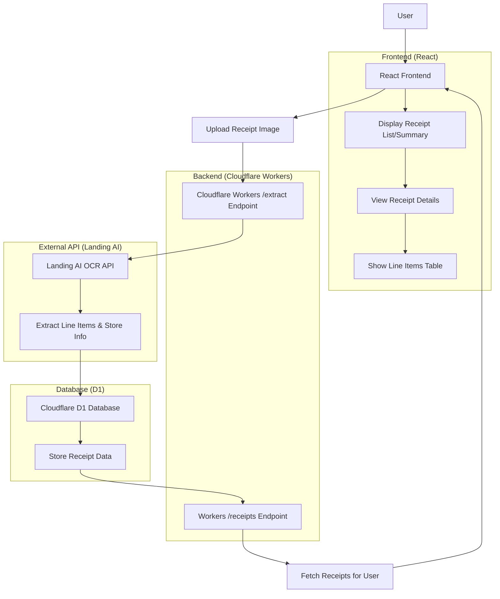

# Groggy - Grocery Receipt Scanner

Groggy is a web app for scanning and managing grocery receipts. Upload a receipt photo, use AI-powered OCR (via Landing AI) to extract line items, store info, and totals, then view summaries or detailed breakdowns.

## Features
- **Receipt Upload**: Scan receipts via file upload (mobile/web compatible).
- **OCR Extraction**: Automatic line item detection (item names, prices) and store details.
- **Receipt Storage**: Securely store receipts in Cloudflare D1 database.
- **User Authentication**: Login/logout with user-specific receipt history.
- **Receipt Views**: List view (summaries) and detail view (full line items table).
- **Responsive UI**: Built with React and Tailwind CSS.

## Architecture

## Tech Stack
- **Frontend**: React, React Router, Tailwind CSS, Radix UI components.
- **Backend**: Cloudflare Workers (serverless functions).
- **Database**: Cloudflare D1 (SQLite-compatible).
- **AI/OCR**: Landing AI API for receipt text extraction.
- **Deployment**: Cloudflare Pages/Workers.
- **Build Tools**: Vite, TypeScript, Bun.

## Setup
1. Clone the repo: `git clone <repo-url>`
2. Install dependencies: `bun install`
3. Set up Cloudflare: Configure Wrangler for Workers/D1.
4. Add env vars: API keys for Landing AI, auth secrets.
5. Deploy: `bun run deploy`

## Usage
1. Log in to access your receipts.
2. Click "Scan Your Grocery Receipt" to upload a photo.
3. View extracted receipts in the list (store name, date, total).
4. Click a receipt for details (full line items table).

## API Endpoints
- `POST /extract`: Upload receipt, process with Landing AI, store in D1.
- `GET /receipts/:userId`: Fetch user's receipts.
- `GET /receipts/:userId/:id`: Fetch single receipt details.

## Contributing
- Report issues at https://github.com/sst/opencode/issues
- For feedback, use the same link.